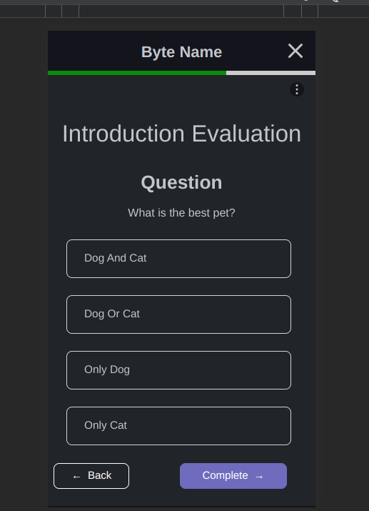

# Recommendations for Spacing Improvements

1. **Establish a Base Spacing Unit**:

   - Choose a base spacing unit 8px for the compact theme and 16px for the normal theme and use it consistently throughout the website.
   - This helps maintain uniformity and makes spacing adjustments easier.

2. **Define Vertical and Horizontal Rhythms**:

   - Ensure vertical and horizontal spacing aligns with multiples of your base unit.
   - For example, use multiples like 8px, 16px, 24px for consistent spacing between elements.

3. **Use Grid Systems for Layout**:

   - Leverage your grid system for placing elements and defining spacing between columns and rows.
   - Grid systems provide structure and ensure elements are aligned properly.

4. **Establish Clear Hierarchy**:

   - Define spacing rules based on the hierarchy of elements (e.g., larger spacing between major sections, smaller spacing between related elements).
   - Maintain consistent relationships between elements to guide users through content logically.

5. **Consider Responsive Design**:
   - Adjust spacing for different screen sizes and devices to ensure optimal viewing and interaction experiences.
   - Test spacing adjustments across various breakpoints to maintain consistency.

# SCSS Approach for Spacing Multiples with Dynamic Themes

1. **Define Varibles for the both themes**

```scss
:root {
  --spacing: 16px; /* Default spacing for Normal theme */
  --spacing-small: calc(var(--spacing) * 0.5); /* 8px for Normal theme */
  --spacing-medium: var(--spacing); /* 16px for Normal theme */
  --spacing-large: calc(var(--spacing) * 2); /* 32px for Normal theme */
}

body.theme-compact {
  --spacing: 8px; /* Override spacing for Compact theme */
  --spacing-small: calc(var(--spacing) * 0.5); /* 4px for Compact theme */
  --spacing-medium: var(--spacing); /* 8px for Compact theme */
  --spacing-large: calc(var(--spacing) * 2); /* 16px for Compact theme */
}
```

2. **Define classes based on these variables**

```scss
/* Utility classes for padding */
.pt-small {
  padding-top: var(--spacing-small);
}
.pt-medium {
  padding-top: var(--spacing-medium);
}
.pt-large {
  padding-top: var(--spacing-large);
}

.pb-small {
  padding-bottom: var(--spacing-small);
}
.pb-medium {
  padding-bottom: var(--spacing-medium);
}
.pb-large {
  padding-bottom: var(--spacing-large);
}

.pl-small {
  padding-left: var(--spacing-small);
}
.pl-medium {
  padding-left: var(--spacing-medium);
}
.pl-large {
  padding-left: var(--spacing-large);
}

.pr-small {
  padding-right: var(--spacing-small);
}
.pr-medium {
  padding-right: var(--spacing-medium);
}
.pr-large {
  padding-right: var(--spacing-large);
}

/* Utility classes for margin */
.mt-small {
  margin-top: var(--spacing-small);
}
.mt-medium {
  margin-top: var(--spacing-medium);
}
.mt-large {
  margin-top: var(--spacing-large);
}

.mb-small {
  margin-bottom: var(--spacing-small);
}
.mb-medium {
  margin-bottom: var(--spacing-medium);
}
.mb-large {
  margin-bottom: var(--spacing-large);
}

.ml-small {
  margin-left: var(--spacing-small);
}
.ml-medium {
  margin-left: var(--spacing-medium);
}
.ml-large {
  margin-left: var(--spacing-large);
}

.mr-small {
  margin-right: var(--spacing-small);
}
.mr-medium {
  margin-right: var(--spacing-medium);
}
.mr-large {
  margin-right: var(--spacing-large);
}
```

3. **Use these classes**

   - Now we can use these classes inside the classname attribute

4. **Toggle between the themes**
   ```js
   document
     .getElementById("theme-toggle")
     .addEventListener("click", function () {
       document.body.classList.toggle("theme-compact");
     });
   ```

# Some issues found:

## Tidbit Collection View


- possible solution: decrease margin

## Edit pages


- possible solution: we can increase margins for normal theme

## Questions options for small screens



- possible solution: less margin

## tidbit card needs spacing


- possible solution: need some padding

## nav


- possible solution: use equal spacing

## Little issues like different padding from different sides

- possible solution: use equal spacing
